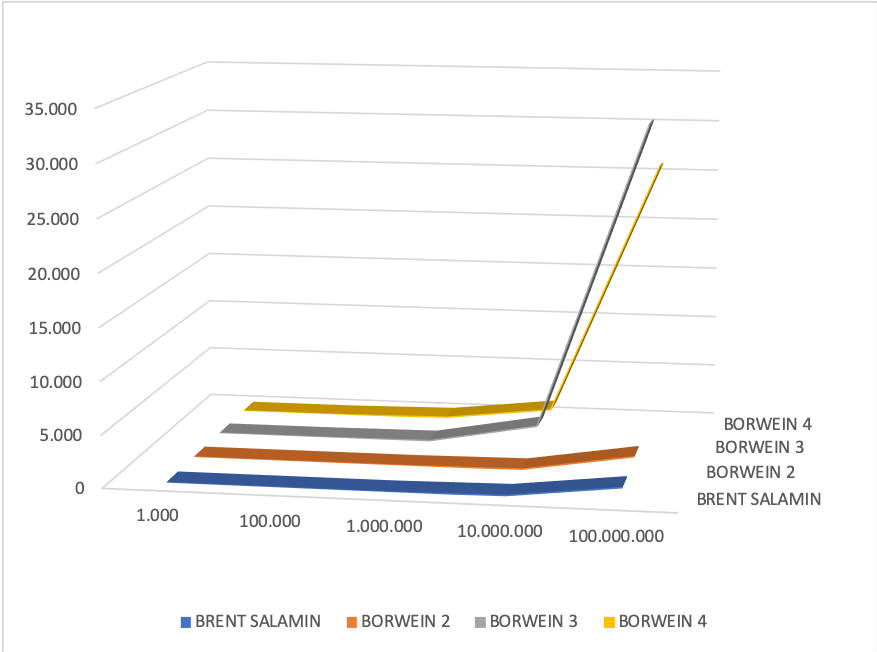

# Computation of Pi

## Introduction
This project presents the problem of approximating the numerical value of the mathematical constant π, considering a number of formulas that have been used to compute π over the centuries. With the development of computer science in the 1950s, it was possible to calculate the expansion of π with precision first of thousands and then millions of decimal places. In this context, the algorithms with various degrees of convergence of the brothers Jonathan and Peter Borwein are presented and the case of calculation of 100 million decimal digits is analyzed.

## Results
The pi.jl file contains the [JULIA](https://julialang.org) implementations of the Brent-Salamin algorithm and the Borwein algorithms.

The graph below shows the execution times and the number of iterations for the calculation of 1 thousand, 100 thousand, 1 million, 10 million and, of course, 100 million. The different algorithms chosen approximate a different number of correct digits for each iteration. In particular, it should be noted that the Borwein quartic algorithm completes the calculation in a lower number of iterations than the other algorithms.

<table>
    <thead>
        <tr>
            <th rowspan=2>Algorithm</th>
            <th colspan=2>1.000</th>
            <th colspan=2>100.000</th>
            <th colspan=2>1.000.000</th>
            <th colspan=2>10.000.000</th>
            <th colspan=2>100.000.000</th>
        </tr>
        <tr>
            <th>NOI</th>
            <th>sec.</th>
            <th>NOI</th>
            <th>sec.</th>
            <th>NOI</th>
            <th>sec.</th>
            <th>NOI</th>
            <th>sec.</th>
            <th>NOI</th>
            <th>sec.</th>
        </tr>
    </thead>
    <tbody>
        <tr>
            <td>Brent-Salamin</td>
            <td style="text-align:right">-</td>
            <td style="text-align:right">0,001285</td>
            <td style="text-align:right">18</td>
            <td style="text-align:right">0,234665</td>
            <td style="text-align:right">21</td>
            <td style="text-align:right">3,466641</td>
            <td style="text-align:right">-</td>
            <td style="text-align:right">135,164755</td>
            <td style="text-align:right">28</td>
            <td style="text-align:right">1.309,265288</td>
        </tr>
        <tr>
            <td>Borwein2</td>
            <td style="text-align:right">10</td>
            <td style="text-align:right">0,003056</td>
            <td style="text-align:right">17</td>
            <td style="text-align:right">0,565460</td>
            <td style="text-align:right">20</td>
            <td style="text-align:right">5,119212</td>
            <td style="text-align:right">23</td>
            <td style="text-align:right">118,202165</td>
            <td style="text-align:right">27</td>
            <td style="text-align:right">1.741,177546</td>
        </tr>
        <tr>
            <td>Borwein3</td>
            <td style="text-align:right">7</td>
            <td style="text-align:right">0,095191</td>
            <td style="text-align:right">11</td>
            <td style="text-align:right">3,408446</td>
            <td style="text-align:right">13</td>
            <td style="text-align:right">81,213809</td>
            <td style="text-align:right">15</td>
            <td style="text-align:right">1.929,500130</td>
            <td style="text-align:right">17</td>
            <td style="text-align:right">31.621,830790</td>
        </tr>
        <tr>
            <td>Borwein4</td>
            <td style="text-align:right">6</td>
            <td style="text-align:right">0,639977</td>
            <td style="text-align:right">9</td>
            <td style="text-align:right">2,942112</td>
            <td style="text-align:right">11</td>
            <td style="text-align:right">149,907742</td>
            <td style="text-align:right">12</td>
            <td style="text-align:right">1.316,241183</td>
            <td style="text-align:right">14</td>
            <td style="text-align:right">26.036,606718</td>
        </tr>
    </tbody>
</table>

Note: Other implementations on other systems may give different results.
